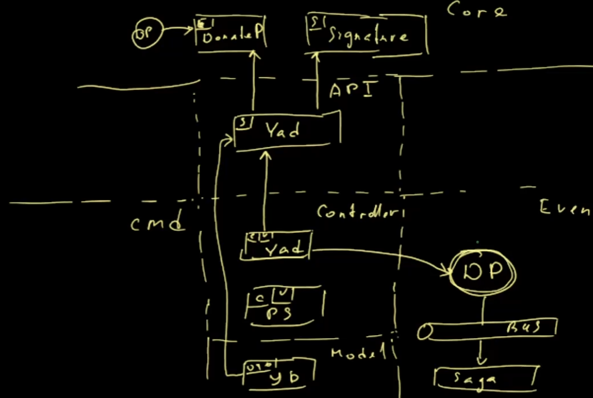

# Вопросы по текущей архитектура

https://platform.soer.pro/#!/pages/workshops/kinescope/813157cf-0c0f-4b00-b7d1-b0dd6be6b28b

## Уровень приложения

### App

**Вопросы**
- Неоднародность в Core: к events, constants, services... идет доступ извне.

#### Решение
- вынесли events в библиотеку @xdonate/common;
- разнесли взаимодействие саги с модулями по модулям:

### PayService
Используются сокращения:
- DP - DonatPayEvent;
- C - котроллер;
- S - сервис;

Работа PayService сейчас

**Вопросы**
- Событие DonatePayEvent лежит на том уровне - Controller знает о ядре;
- DonatePayEvent лежит в Core (событие используется только в PayService);
- ...